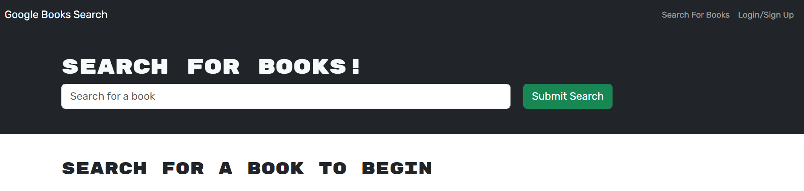
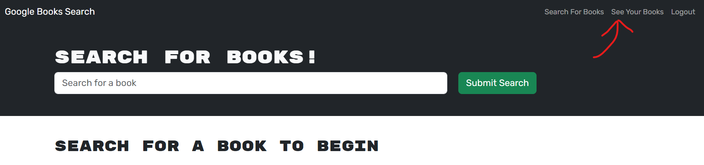
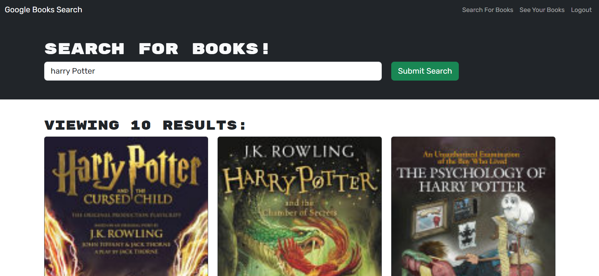
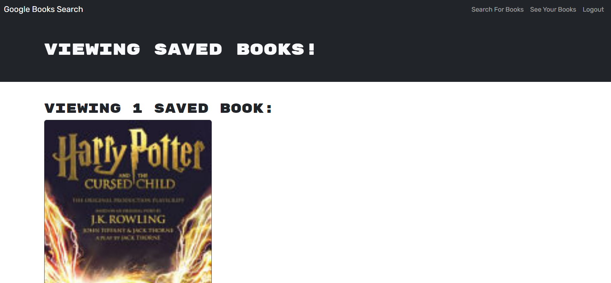
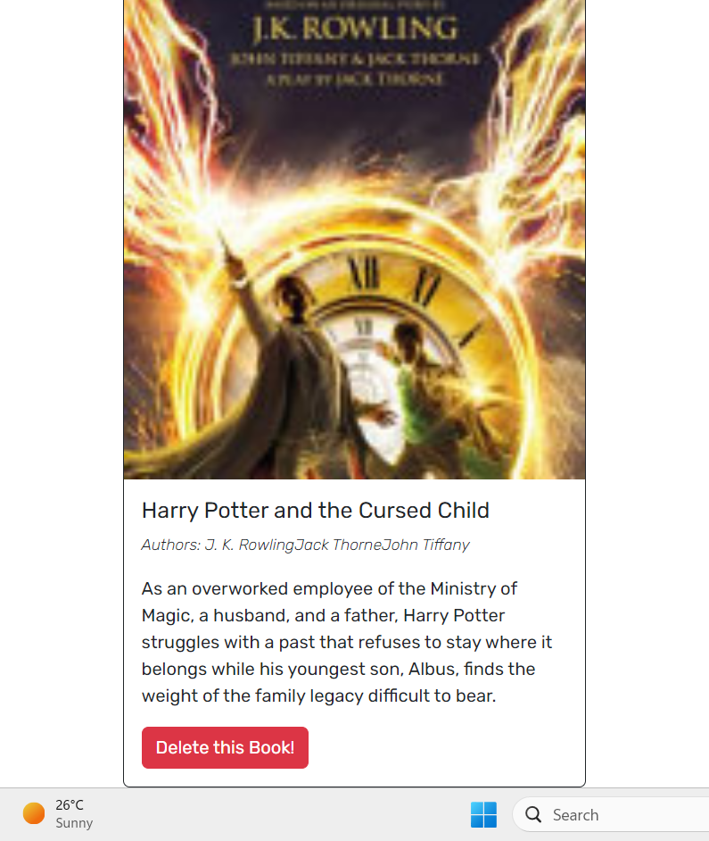

# Book Search Engine

## Your Task

I’ll refactor starter code with a fully functioning Google Books API search engine built with a RESTful API to be a GraphQL API built with Apollo Server. The app was built using the MERN stack with a React front end, MongoDB database, and Node.js/Express.js server and API. It's already set up to allow users to save book searches to the back end.

## User Story

- When I load the search engine, then I am presented with a menu with the options Search for Books and Login/Signup and an input field to search for books and a submit button
- When I click on the Search for Books menu option, then I am presented with an input field to search for books and a submit button
- When I am not logged in and enter a search term in the input field and click the submit button, then I am presented with several search results, each featuring a book’s title, author, description, image, and a link to that book on the Google Books site
- When I click on the Login/Signup menu option, then a modal appears on the screen with a toggle between the option to log in or sign up
- When the toggle is set to Signup, then I am presented with three inputs for a username, an email address, and a password, and a signup button
- When the toggle is set to Login, then I am presented with two inputs for an email address and a password and login button
- When I enter a valid email address and create a password and click on the signup button, then my user account is created and I am logged in to the site
- When I enter my account’s email address and password and click on the login button, then I the modal closes and I am logged in to the site
- When I am logged in to the site, then the menu options change to Search for Books, an option to see my saved books, and Logout
- When I am logged in and enter a search term in the input field and click the submit button, then I am presented with several search results, each featuring a book’s title, author, description, image, and a link to that book on the Google Books site and a button to save a book to my account
- When I click on the Save button on a book, then that book’s information is saved to my account
- When I click on the option to see my saved books, then I am presented with all of the books I have saved to my account, each featuring the book’s title, author, description, image, and a link to that book on the Google Books site and a button to remove a book from my account
- When I click on the Remove button on a book, then that book is deleted from my saved books list
- When I click on the Logout button, then I am logged out of the site and presented with a menu with the options Search for Books and Login/Signup

## Screenshot

- Here is the main page.\
  
- When you click on Login/Signup, the login form pop up.\
  
- When logged in, the top right corner of the page changed.\
  
- When search book, results appear.\
  
- When you click on save book, the book is saved in your profile.\
  
- When you click on see book on the top right, you can see the books saved.\
  
- When you click on delete book (might be you have to click twice), the book disappears.\
  

## Deployment

- Github: [Link](https://github.com/cckinwest/Week21-Book-Search-Engine)
